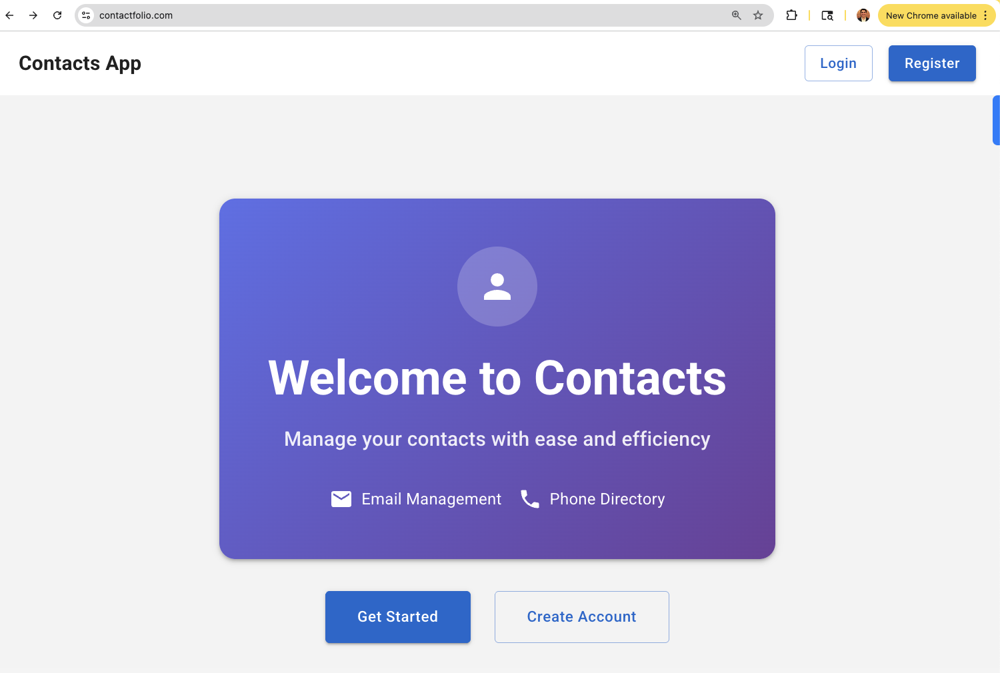
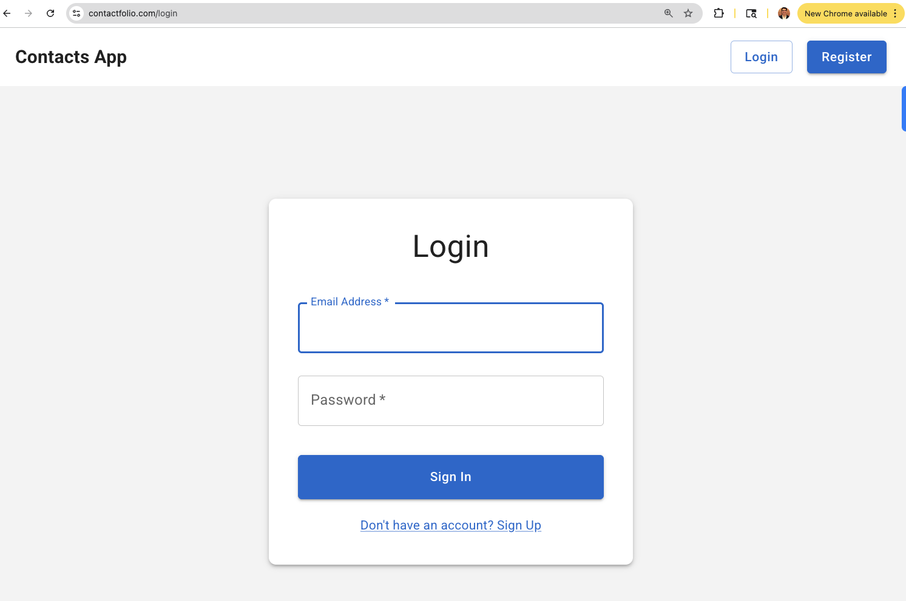
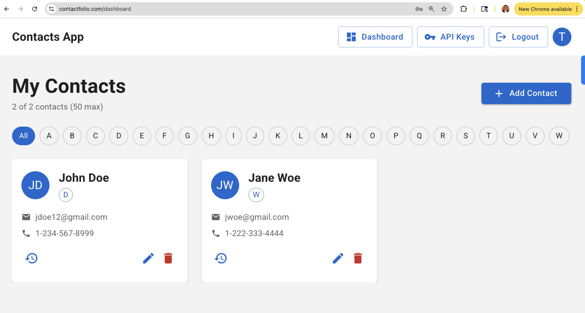
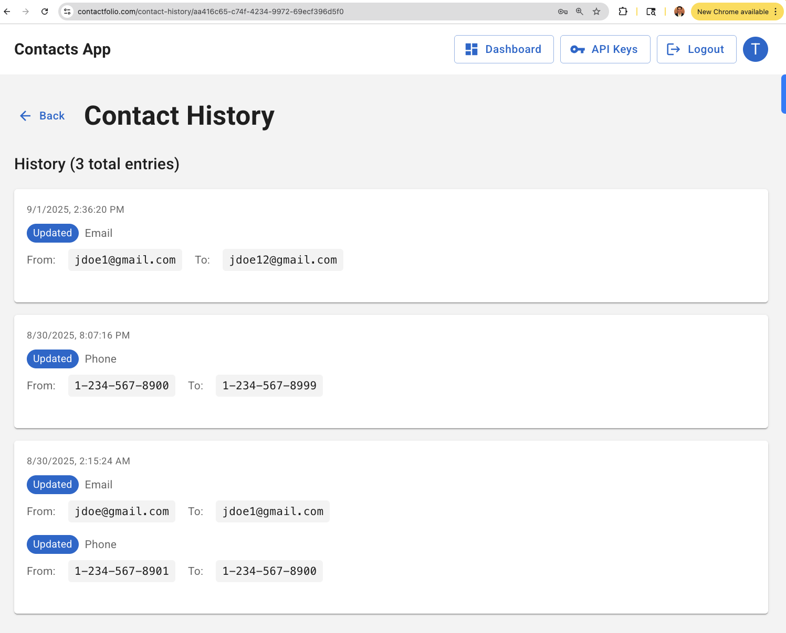
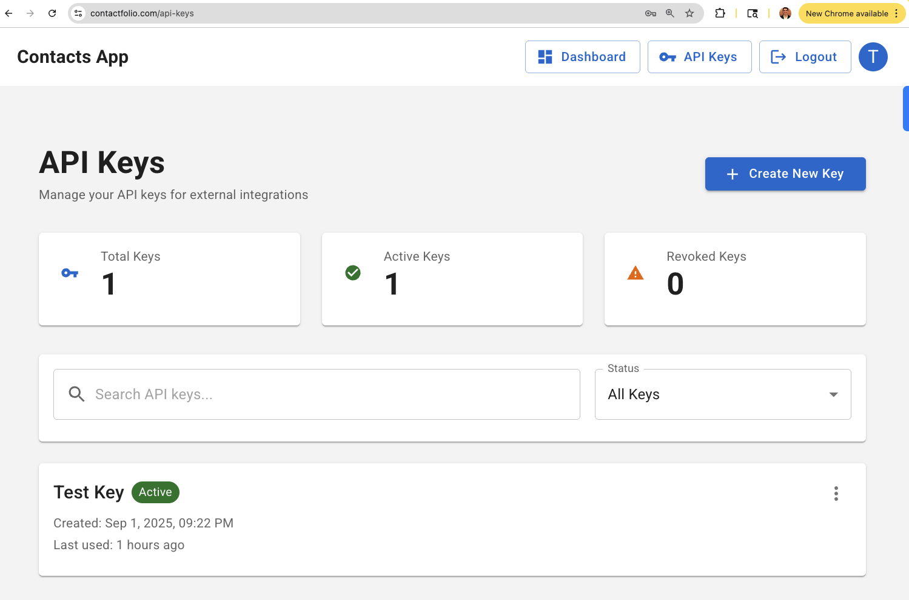
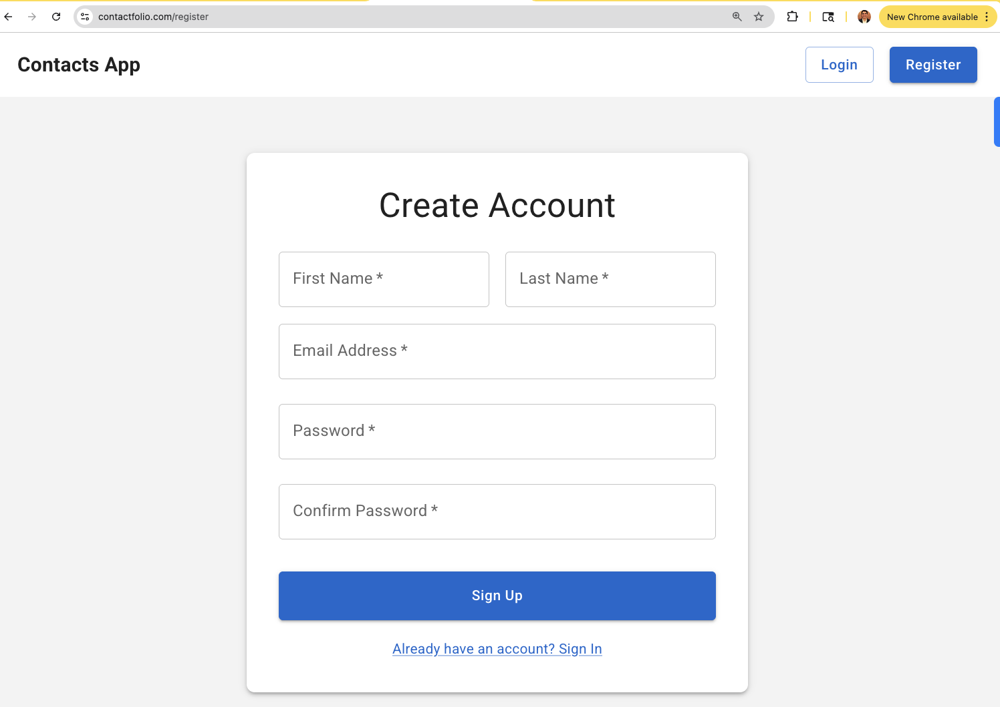

# ContactFolio 📱

> **A modern, real-time contact management platform with external API integration**


## 🚀 Overview

ContactFolio is a full-stack contact management application that provides real-time synchronization across multiple clients, external API integration for third-party systems, and a modern, responsive user interface. Built with modern web technologies and following best practices for scalability, security, and maintainability.

---

## 🌐 **Live Application**

**[🚀 Try ContactFolio Now → https://contactfolio.com/](https://contactfolio.com/)**

*This is the production deployment of ContactFolio, demonstrating the full application in action.*

### 📱 Application Screenshots

| Landing Page | Login | Dashboard |
|:---:|:---:|:---:|
|  |  |  |

| Contact History | API Keys | Registration |
|:---:|:---:|:---:|
|  |  |  |

---

## ✨ Key Features

### 🔄 Real-Time Updates
- **Server-Sent Events (SSE)** for instant contact synchronization
- **Live updates** across all connected clients
- **No page refresh required** for contact changes

### 🌐 External API Integration
- **API Key authentication** for secure external access
- **RESTful API** with comprehensive CRUD operations

### 📱 Modern User Experience
- **Material-UI components** for consistent, beautiful interfaces
- **Pagination** for large contact lists

### 🔒 Security & Performance
- **Session-based authentication** with secure session management
- **API key management** with hash-based storage
- **Rate limiting** to prevent abuse
- **Redis caching** for improved performance

## 🏗️ Architecture

```
┌─────────────────┐    ┌─────────────────┐    ┌─────────────────┐
│   Frontend      │    │   Backend       │    │   Database      │
│   (Next.js)     │◄──►│   (Express.js)  │◄──►│   (PostgreSQL)  │
│                 │    │                 │    │                 │
│ • TypeScript    │    │ • TypeScript    │    │ • Prisma ORM    │
│ • React         │    │ • REST API      │    │ • Indexing      │
│ • Material-UI   │    │ • SSE Events    │    │ • Auto-scaling  │
│                 │    │ • Redis         │    │                 │
└─────────────────┘    └─────────────────┘    └─────────────────┘
         │                       │                       │
         │                       │                       │
         ▼                       ▼                       ▼
┌─────────────────┐    ┌─────────────────┐    ┌─────────────────┐
│ CloudFront + S3 │    │   Load Balancer │    │   Redis Cache   │
│      (CDN)      │    │   (ALB + ECS)   │    │   (Sessions)    │
│                 │    │                 │    │                 │
│ • Static assets │    │ • SSL/TLS       │    │ • Session store │
│ • Global edge   │    │ • Health checks │    │                 │
│                 │    │ • ECS Fargate   │    │                 │
└─────────────────┘    └─────────────────┘    └─────────────────┘
```

## 🛠️ Tech Stack

### Frontend
- **Framework**: Next.js 14 with TypeScript & React
- **UI Library**: Material-UI (MUI) v5
- **State Management**: React Query (TanStack Query)
- **Styling**: Emotion (CSS-in-JS)
- **Testing**: Jest + React Testing Library

### Backend
- **Runtime**: Node.js with TypeScript
- **Framework**: Express.js
- **Database**: PostgreSQL with Prisma ORM
- **Authentication**: Redis Sessions + bcrypt
- **Validation**: Joi schemas
- **Testing**: Jest + Supertest

### Infrastructure
- **Cloud**: AWS CDK for Python
- **Compute**: AWS Fargate
- **Database**: Amazon RDS (PostgreSQL)
- **Cache**: Amazon ElastiCache (Redis)
- **CDN**: CloudFront & S3
- **Load Balancer**: Application Load Balancer

### DevOps
- **CI/CD**: GitHub Actions
- **Containerization**: Docker
- **Infrastructure as Code**: AWS CDK (Python)
- **Monitoring**: CloudWatch

## 🚀 Quick Start

### Prerequisites
- Node.js 18+ 
- Docker
- PostgreSQL (local development)
- Redis (local development)

### 1. Clone the Repository
```bash
git clone https://github.com/yourusername/contacts.git
cd contacts
```

### 2. Start Development Environment
```bash
# Start all services
./scripts/dev.sh

# Or start individually:
cd backend && npm run dev
cd frontend && npm run dev
```

### 3. Access the Application
- **Frontend**: http://localhost:3001
- **Backend API**: http://localhost:3000
- **Database**: localhost:5432

## 📖 Documentation

- **[Backend API Documentation](./backend/README.md)** - API endpoints, authentication, and development setup
- **[Frontend Documentation](./frontend/README.md)** - Component structure, state management, and development workflow
- **[Infrastructure Documentation](./infra/README.md)** - AWS CDK setup and deployment

## 🔧 Development

### Project Structure
```
contacts/
├── .github/         # GitHub Actions - CI/CD
├── backend/         # Express.js API server
├── frontend/        # Next.js web application
├── infra/           # AWS CDK infrastructure
├── scripts/         # Development and deployment scripts
└── README/          # Documentation
```

### Key Commands
```bash
# Backend
npm run dev          # Start development server
npm run test         # Run tests
npm run build        # Build for production

# Frontend
npm run dev          # Start development server
npm run test         # Run tests
npm run build        # Build for production

# Infrastructure
cd infra && cdk deploy  # Deploy to AWS
```

## 🚀 Deployment

### Automated Deployment
The project uses GitHub Actions for continuous deployment:

1. **Push to main branch** triggers CI/CD pipeline
2. **Tests run** on both backend and frontend
3. **Infrastructure deploys** to AWS
4. **Application deploys** automatically

### Manual Deployment
```bash
# Deploy infrastructure
cd infra && cdk deploy

# Deploy backend
cd backend && npm run deploy

# Deploy frontend
cd frontend && npm run build && npm run deploy
```

## 🧪 Testing

### Backend Testing
- **Unit tests** for controllers and services (IN PROGRESS)
- **Integration tests** for API endpoints (TODO)
- **End-to-End testing** with Supertest (TODO)
- **Coverage reporting** with Jest ✅
- **Test utilities** and mocking helpers ✅

### Frontend Testing
- **Unit tests** for utilities and hooks (TODO)
- **Component tests** with React Testing Library (IN PROGRESS)
- **End-to-End testing** with Supertest (TODO)
- **Coverage reporting** with Jest ✅
- **Test utilities** and mocking helpers ✅

### Running Tests
```bash
# Backend tests
cd backend && npm test

# Frontend tests
cd frontend && npm test

# All tests (CI/CD)
npm run test:ci
```

## 🤝 Contributing

1. **Fork the repository**
2. **Create a feature branch** (`git checkout -b feature/amazing-feature`)
3. **Commit your changes** (`git commit -m 'Add amazing feature'`)
4. **Push to the branch** (`git push origin feature/amazing-feature`)
5. **Open a Pull Request**

### Development Guidelines
- Follow TypeScript best practices
- Write tests for new features
- Update documentation as needed
- Follow the existing code style

## 📄 License

This project is licensed under the MIT License - see the [LICENSE](LICENSE) file for details.

## 🙏 Acknowledgments

- **Material-UI** for the beautiful component library
- **Prisma** for the excellent ORM
- **Next.js** for the amazing React framework
- **AWS CDK** for infrastructure as code

## 📞 Support

- **Issues**: [GitHub Issues](https://github.com/yourusername/contacts/issues)
- **Discussions**: [GitHub Discussions](https://github.com/yourusername/contacts/discussions)
- **Documentation**: [Project Wiki](https://github.com/yourusername/contacts/wiki)

---
